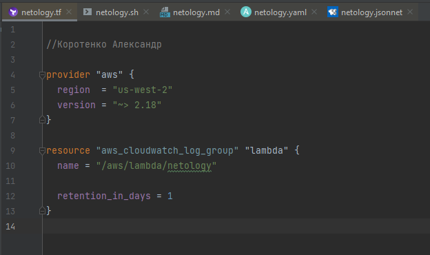
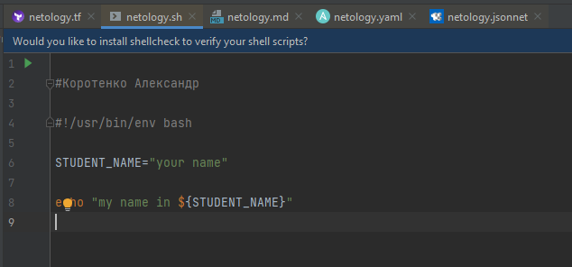
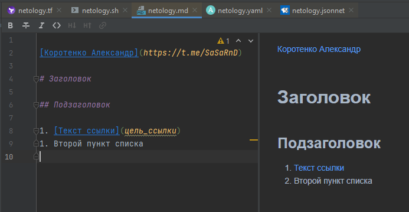
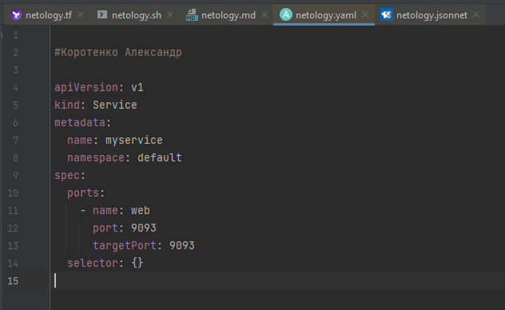
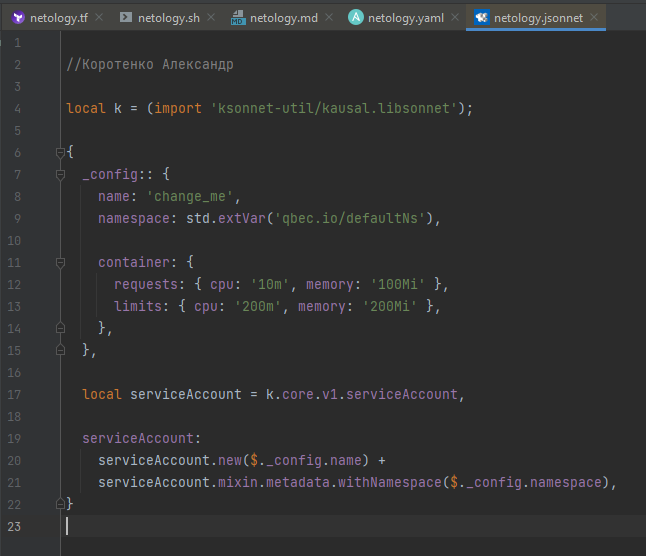

## Как сдавать задания

Обязательными к выполнению являются задачи без указания звездочки. Их выполнение необходимо для получения зачета и диплома о профессиональной переподготовке.

Задачи со звездочкой (*) являются дополнительными задачами и/или задачами повышенной сложности. Они не являются обязательными к выполнению, но помогут вам глубже понять тему.

Домашнее задание выполните в файле readme.md в github репозитории. В личном кабинете отправьте на проверку ссылку на .md-файл в вашем репозитории.

Также вы можете выполнить задание в [Google Docs](https://docs.google.com/document/u/0/?tgif=d) и отправить в личном кабинете на проверку ссылку на ваш документ.
Название файла Google Docs должно содержать номер лекции и фамилию студента. Пример названия: "1.1. Введение в DevOps — Сусанна Алиева".

Если необходимо прикрепить дополнительные ссылки, просто добавьте их в свой Google Docs.

Перед тем как выслать ссылку, убедитесь, что ее содержимое не является приватным (открыто на комментирование всем, у кого есть ссылка), иначе преподаватель не сможет проверить работу. Чтобы это проверить, откройте ссылку в браузере в режиме инкогнито.

[Как предоставить доступ к файлам и папкам на Google Диске](https://support.google.com/docs/answer/2494822?hl=ru&co=GENIE.Platform%3DDesktop)

[Как запустить chrome в режиме инкогнито ](https://support.google.com/chrome/answer/95464?co=GENIE.Platform%3DDesktop&hl=ru)

[Как запустить  Safari в режиме инкогнито ](https://support.apple.com/ru-ru/guide/safari/ibrw1069/mac)

Любые вопросы по решению задач задавайте в чате Slack.

---

# Домашнее задание к занятию «1.1. Введение в DevOps»

## Задание №1 - Подготовка рабочей среды

Вы пришли на новое место работы или приобрели новый компьютер.
Первым делом надо настроить окружение для дальнейшей работы. 

1. Установить Py Charm Community Edition: https://www.jetbrains.com/ru-ru/pycharm/download/ - это бесплатная версия IDE. 
Если у вас уже установлен любой другой продукт от JetBrains,то можно использовать его. 
1. Установить плагины:
    - Terraform,
    - MarkDown,
    - Yaml/Ansible Support,
    - Jsonnet.
1. Склонировать текущий репозиторий или просто создать файлы для проверки плагинов:
    - [netology.tf](netology.tf) – терраформ,
    - [netology.sh](netology.sh) – bash,
    - [netology.md](netology.md) – markdown, 
    - [netology.yaml](netology.yaml) – yaml,
    - [netology.jsonnet](netology.jsonnet) – jsonnet.
1. Убедитесь, что работает подсветка синтаксиса, файлы должны выглядеть вот так:
    - Terraform: 
    - Bash: 
    - Markdown: 
    - Yaml: 
    - Jsonnet: 
1. Добавьте свое имя в каждый файл, сделайте снимок экран и загрузите его на любой сервис обмена картинками.
1. Ссылки на картинки укажите в личном кабинете как решение домашнего задания. 

## Задание №2 - Описание жизненного цикла задачи (разработки нового функционала)

Чтобы лучше понимать предназначение дальнейших инструментов, с которыми нам предстоит работать, давайте 
составим схему жизненного цикла задачи в идеальном для вас случае.

### Описание истории

Представьте, что вы работаете в стартапе, который запустил интернет-магазин. Ваш интернет-магазин достаточно успешно развивался, и вот пришло время налаживать процессы: у вас стало больше конечных клиентов, менеджеров и разработчиков.Сейчас от клиентов вам приходят задачи, связанные с разработкой нового функционала. Задач много, и все они требуют выкладки на тестовые среды, одобрения тестировщика, проверки менеджером перед показом клиенту. В случае необходимости, вам будет необходим откат изменений. 

### Решение задачи

Вам необходимо описать процесс решения задачи в соответствии с жизненным циклом разработки программного обеспечения. Использование какого-либо конкретного метода разработки не обязательно. Для решения главное - прописать по пунктам шаги решения задачи (релизации в конечный результат) с участием менеджера, разработчика (или команды разработчиков), тестировщика (или команды тестировщиков) и себя как DevOps-инженера. 

 
# Домашнее задание №2

Итак, жизненный цикл программного обеспечения (ПО) — это 6 основных стадий, через которые проходит любая разработка ПО:

1. Сбор и анализ требований к программному продукту (ПП).
2. Разработка документации для всех требований к ПП.
3. Разработка дизайна ПП.
4. Разработка программного обеспечения для ПП.
5. Прохождение различных тестов.
6. Ввод в эксплуатацию ПО и поддержка ПП.

Рассмотрим нашу задачу подробно:

1. К нашему Программному Продукту (ПП) (Интернет-магазину) поступила задача на разработку нового функционала.
    1.1. Закрепленный за клиентом менеджер, дает задание DevOps-инженеру: завести необходимые записи в программе ведения и учета текущего Проекта, связанные с отслеживанием всех этапов реализации новой задачи.
    1.2. Менеджер выясняет у Клиента все подробности и нюансы требований нового функционала, указанного в задаче, к ПП.
    1.3. Бизнес-аналитик проводит анализ сформированных требований поступившей задачи.
2. Менеджер разрабатывает документ "Проектное Решение" новой задачи.
    2.1. Менеджер дает задание Дизайнеру на проектирование Дизайн-макета будущего функционала.
    2.2. После получения макетов, менеджер добавляет необходимое и достаточное описание для разработчиков.
    2.3. Менеджер получает от разработчиков приблизительные временнЫе затраты, необходимые для реализации новой задачи.
    2.4. Менеджер делает общую стоимостную оценку реализации новой задачи
    2.5. Менеджер согласовывает стоимость и все этапы реализации новой задачи с Клиентом. 
3. Менеджер дает старт начала реализации новой задачи.
    3.1. Менеджер дает задание DevOps-инженеру: завести необходимую по характеристикам и окружению среду у Дизайнера для реализации элементов новой задачи. 
    3.2. Менеджер дает задание Дизайнеру начать реализацию всех необходимых элементов новой задачи.
    3.3. Менеджер согласовывает все элементы нового функционала, подготовленные Дизайнером, с Клиентом.
4. Менеджер дает старт начала реализации этапа разработки новой задачи.
    4.1. Менеджер дает задание DevOps-инженеру: завести необходимые по характеристикам и окружению среды у разработчиков для реализации новой задачи.
    4.2. Менеджер дает задание Team-лидеру разработчиков: начать реализацию всего необходимого функционала новой задачи.
    4.3. Team-лидер дает задание разработчикам: написать все необходимые виды тестов для различных этапов тестирования.
5. Менеджер дает старт начала реализации этапа тестирования разработанного ПО новой задачи.
    5.1. Менеджер дает задание DevOps-инженеру: завести необходимые по характеристикам и окружению среды у тестировщиков для новой задачи.
    5.2. Менеджер дает задание Старшему тестировщику: запустить необходимые виды тестов (unit, функциональные, приемочные).
    5.3. По результатам тестов, код нового функционала, или отправляется на доработку разработчикам (п.4.2), или собирается в релиз и, перед переходом на следующий этап, проходит согласование Менеджером у Клиента.
    5.4. DevOps-инженер непрерывно следит за работой релиза нового функционала на тестовом стенде или непосредственно в продакшн-окружении и, в случае частичного или полного отказа ПО по причине некорректной работы функционала нового релиза, обеспечивает откат всех изменений до последнего стабильного релиза.
6. Ввод в эксплкатацию ПО и поддержка ПП.
    6.1. Менеджер согласовывает с Клиентом ввод в эксплуатацию стабильного релиза нового функционала.
    6.2. Менеджер дает задание DevOps-инженеру: провести последние проверки релиза "боевой" нагрузкой.
    6.3. DevOps-инженер проводит быстрый, но максимально защищенный от "падений" ввод в эксплуатацию стабильного релиза нового функционала.
    6.4. В течении периода гарантированно-безотказной работы нового функционала, DevOps-инженер отслеживает ключевые параметры работы всего ПП по системе его мониторинга, обеспечивая возможность бесперебойной работы.
    6.5. По истечении периода гарантированно-безотказной работы нового функционала, DevOps-инженер передает обязанность отслеживания системы мониторинга работы нового функционала в составе ПП службе технической поддержки, которая будет обеспечивать бесперебойную работу всего ПП в дальнейшем.

#### На мой взгляд, DevOps-инженер должен обеспечивать максимальную "гладкость" и беспрепятственность процесса разработки ПО, а также возможность устранения "багов" разработчиками в самые кратчайшие сроки, от начала разработки, до ввода в эксплуатацию ПО. 

